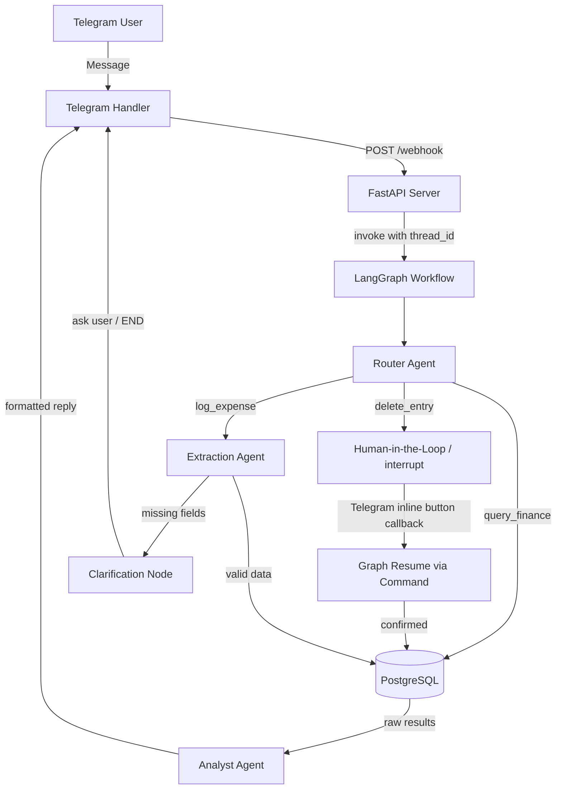

# Agentic AI Personal Finance Assistant — Implementation Plan

## Overview

Build a production-grade multi-agent personal finance bot with:
- **Telegram** as the user interface (`python-telegram-bot` v21+ using @BotFather)
- **LangGraph** as the orchestration engine (cyclic state graph with checkpointing)
- **PydanticAI** for structured data extraction
- **PostgreSQL** as the analytical data store (via SQLAlchemy async) running on Supabase
- **FastAPI** as the webhook/API server

The system strictly enforces **No LLM Math** — all aggregations happen in SQL via parameterized query templates, never LLM-generated SQL.

---

## Architecture



---

## Proposed Changes

### 1. Project Root & Configuration

#### `requirements.txt`
All dependencies pinned:
- `python-telegram-bot[webhooks]>=21.0`
- `fastapi`, `uvicorn[standard]`
- `langgraph>=0.2`, `langchain-core`, `langchain-openai`
- `pydantic-ai>=0.1`
- `sqlalchemy[asyncio]`, `asyncpg`
- `python-dotenv`
- `pydantic>=2.0`

> **Note:** LangGraph v0.2+ is required for the `interrupt()` / `Command` HITL pattern used in the delete confirmation flow.

#### `.env.example`
Template for environment variables:
```
TELEGRAM_TOKEN=
POSTGRES_URL=postgresql+asyncpg://...
OPENAI_API_KEY=
WEBHOOK_URL=https://your-domain.com/webhook
```

#### `main.py`
Application launcher:
- Initializes FastAPI with lifespan context
- On startup: verifies DB connection, calls `init_db()`, and **registers the Telegram webhook** by calling `await bot.set_webhook(url=settings.WEBHOOK_URL)` — this step must happen explicitly or Telegram will not route updates to the server
- On shutdown: calls `await bot.delete_webhook()`

---

### 2. Data Layer (`/app/database/`)

#### `connection.py`
- Async SQLAlchemy engine & session factory using `asyncpg`
- `get_db_session()` async context manager for use in agents
- `init_db()` — creates all tables on startup and seeds `Category` rows if absent

#### `models.py`
SQLAlchemy ORM models:

- **`User`**: `telegram_id` (BigInteger, unique), `username` (nullable), `created_at`
- **`Category`**: `id`, `name` (from fixed list), seeded on first run. Use `INSERT ... ON CONFLICT DO NOTHING` to safely re-seed on every startup.
- **`Expense`**: `id`, `user_id` (FK → User), `category_id` (FK → Category), `item` (Text), `amount` (Numeric(12,2)), `currency` (String, default `"EGP"`), `created_at`

> **Note:** `telegram_id` must be `BigInteger`, not `Integer` — Telegram user IDs exceed 32-bit integer range.

---

### 3. Orchestration Layer (`/app/graph/`)

#### `state.py`
`AgentState` as a `TypedDict` with fields:

```python
class AgentState(TypedDict):
    thread_id: str                     # LangGraph checkpointer key (= telegram_id as str)
    user_message: str
    telegram_id: int
    conversation_history: list[dict]   # [{role, content}] — required for multi-turn clarification
    intent: str | None                 # "log_expense" | "query_finance" | "delete_entry"
    extracted_data: dict | None        # Parsed ExpenseSchema fields
    query_key: str | None              # Key into QUERY_TEMPLATES (replaces LLM-generated SQL)
    query_params: dict | None          # Parameterized values for the selected template
    sql_result: list[dict] | None      # Raw rows returned from DB
    needs_clarification: bool
    clarification_question: str | None
    pending_confirmation: bool         # True when waiting for HITL inline button
    confirmation_action: dict | None   # Stores the delete target while waiting
    response: str | None              # Final reply to send to Telegram
    error: str | None
```

> **Key addition:** `conversation_history` is required to carry prior turns through the clarification loop. Without it, the LLM loses context when re-invoked after the user answers a clarification question.
>
> **Key addition:** `thread_id` (set to `str(telegram_id)`) is the LangGraph checkpointer config key. It is **required** for `interrupt()` / `Command` resume to work correctly.

#### `workflow.py`
LangGraph `StateGraph` construction:

**Checkpointer setup:**
```python
# Development
from langgraph.checkpoint.memory import MemorySaver
checkpointer = MemorySaver()

# Production (recommended) — use the async PostgreSQL checkpointer
# from langgraph.checkpoint.postgres.aio import AsyncPostgresSaver
# checkpointer = AsyncPostgresSaver.from_conn_string(settings.POSTGRES_URL)

graph = builder.compile(checkpointer=checkpointer)
```

**Nodes:** `route`, `extract`, `clarify`, `confirm_delete`, `execute_db`, `analyze`

**Conditional edges:**
- After `route`: branch on `intent` → `extract` / `execute_db` / `confirm_delete`
- After `extract`: if `needs_clarification` → `clarify` (→ END, awaiting user reply); else → `execute_db`
- After `confirm_delete`: uses `interrupt()` to pause graph → END (Telegram sends inline keyboard); on callback, graph resumes via `graph.invoke(Command(resume=confirmed_bool), config)`
- After `execute_db` → `analyze` → END

**Graph invocation pattern:**
```python
config = {"configurable": {"thread_id": str(telegram_id)}}
# Initial invoke
result = await graph.ainvoke({"user_message": text, ...}, config=config)

# Resume after HITL callback
from langgraph.types import Command
result = await graph.ainvoke(Command(resume=True), config=config)
```

---

### 4. Agent Layer (`/app/agents/`)

#### `router.py`
- `route_request(state) -> AgentState`
- Uses LLM to classify intent as `log_expense`, `query_finance`, or `delete_entry`
- Appends the user message to `conversation_history` before calling the LLM
- System prompt includes clear examples per intent plus an `unknown` fallback
- If intent cannot be resolved → sets `needs_clarification=True` with a friendly prompt
- Returns updated state with `intent` field

#### `extractor.py`
- **`FIXED_CATEGORIES`** (Literal): `Food`, `Transport`, `Utilities`, `Entertainment`, `Electronics`, `Health`, `Education`, `Shopping`, `Housing`, `Other`

- **`ExpenseSchema`** Pydantic model:
  ```python
  class ExpenseSchema(BaseModel):
      item: str
      amount: Decimal | None = None
      currency: str = "EGP"          # Field-level default, not just a comment
      category: Literal[*FIXED_CATEGORIES]
  ```

- `extract_data(state) -> AgentState`
  - Uses PydanticAI `Agent` with **`result_type=ExpenseSchema`** *(not `output_type` — that parameter does not exist in PydanticAI)*
  - Passes `conversation_history` as context for multi-turn accuracy
  - If `amount is None` → sets `needs_clarification=True` with a friendly question, does **not** crash
  - Category normalization baked into the LLM system prompt (e.g., "taxi" → `Transport`)

> **Critical fix:** PydanticAI uses `result_type`, not `output_type`. Using `output_type` raises a `TypeError` at runtime.

#### `db_agent.py`
- `execute_operation(state) -> AgentState`

**For `log_expense`:**
  - Upserts `User` record by `telegram_id` (INSERT ON CONFLICT DO NOTHING)
  - Resolves `category_id` from the `Category` table by name
  - Inserts `Expense` row via SQLAlchemy ORM — no raw SQL

**For `query_finance`:** Uses a **pre-defined, parameterized query template library** — never LLM-generated SQL. This upholds the "No LLM Math" rule and eliminates SQL injection risk.

  ```python
  QUERY_TEMPLATES = {
      "total_by_category": """
          SELECT c.name, SUM(e.amount) AS total
          FROM expenses e JOIN categories c ON e.category_id = c.id
          WHERE e.user_id = :user_id AND e.created_at >= :since
          GROUP BY c.name ORDER BY total DESC
      """,
      "total_this_month": """
          SELECT SUM(amount) AS total FROM expenses
          WHERE user_id = :user_id
            AND DATE_TRUNC('month', created_at) = DATE_TRUNC('month', NOW())
      """,
      "recent_expenses": """
          SELECT item, amount, currency, created_at FROM expenses
          WHERE user_id = :user_id ORDER BY created_at DESC LIMIT :limit
      """,
      # Add more templates as needed
  }
  ```
  - The `router.py` or a lightweight classifier sets `state["query_key"]` and `state["query_params"]`; `db_agent.py` only looks up and executes the template
  - All values are passed as SQLAlchemy `:param` bindings — never string-interpolated

**For `delete_entry`:**
  - Executes DELETE only after `pending_confirmation=True` is cleared by the HITL resume
  - Uses `WHERE id = :expense_id AND user_id = :user_id` to prevent cross-user deletion

**Empty result handling:** Always check `if not sql_result` before returning; set a meaningful `response` like "No expenses found for that period."

#### `analyst.py`
- `summarize_response(state) -> AgentState`
- Takes `sql_result` (raw rows) and formats them into natural language
- **Always checks for empty/null results** first and returns a friendly message if so
- Uses LLM for personality and formatting **only** — no arithmetic
- Can produce a structured financial summary if `query_key` indicates a report-style query
- Appends the assistant response to `conversation_history` for continuity

---

### 5. Interface & API Layer (`/app/interface/` & `/app/api/`)

#### `app/interface/telegram_handler.py`
- `handle_message(update, context)` — Extracts `telegram_id` and text; calls the FastAPI `/process` endpoint or directly invokes the graph; sends the `response` back to the user
- `handle_callback(update, context)` — Processes Yes/No inline keyboard buttons for delete confirmation:
  - Extracts `telegram_id`, resolves `thread_id`
  - Calls `graph.ainvoke(Command(resume=confirmed), config={"configurable": {"thread_id": thread_id}})`
  - Answers the callback query to dismiss the loading spinner
- Registers both handlers with the PTB `Application`

#### `app/api/server.py`
- FastAPI app with lifespan manager (DB init + webhook registration on startup)
- `POST /webhook` — Receives raw Telegram `Update` JSON, deserializes it, and dispatches to the PTB `Application`
- `POST /process` (internal) — Runs the graph for a given message and returns the response string
- All endpoints are fully async

---

### 6. Configuration (`app/config.py`)

- Loads `.env` via `python-dotenv`
- Pydantic `Settings` class for type-safe, validated config access:
  ```python
  class Settings(BaseSettings):
      telegram_token: str
      postgres_url: str
      openai_api_key: str
      webhook_url: str
      model_config = SettingsConfigDict(env_file=".env")
  ```
- Single `settings = Settings()` singleton imported across the app

---

## Project Structure

```
project_root/
├── main.py
├── requirements.txt
├── .env.example
└── app/
    ├── __init__.py
    ├── config.py
    ├── database/
    │   ├── __init__.py
    │   ├── connection.py
    │   └── models.py
    ├── graph/
    │   ├── __init__.py
    │   ├── state.py
    │   └── workflow.py
    ├── agents/
    │   ├── __init__.py
    │   ├── router.py
    │   ├── extractor.py
    │   ├── db_agent.py
    │   └── analyst.py
    ├── interface/
    │   ├── __init__.py
    │   └── telegram_handler.py
    └── api/
        ├── __init__.py
        └── server.py
```

---

## Key Design Decisions

1. **No LLM Math** — All SUM/COUNT/AVG executed in PostgreSQL via pre-defined, parameterized query templates. The LLM selects a template key and supplies parameters; it never writes SQL.

2. **Human-in-the-Loop via `interrupt()` / `Command`** — Delete operations use LangGraph's native `interrupt()` to pause the graph. The graph resumes via `graph.ainvoke(Command(resume=confirmed), config)` when the user taps the inline keyboard button. This is the correct LangGraph v0.2+ HITL pattern — not a manual flag poll.

3. **Checkpointing is mandatory for HITL** — A `MemorySaver` (dev) or `AsyncPostgresSaver` (prod) checkpointer must be attached to the compiled graph. Without it, `interrupt()` has no state to resume from.

4. **`thread_id` = `str(telegram_id)`** — Each Telegram user maps to one LangGraph thread. This scopes all checkpointed state and history per user automatically.

5. **`conversation_history` in state** — Carried through all nodes so clarification loops, multi-turn queries, and the analyst's reply all have full context. Each agent appends to it; the state accumulates the full session.

6. **Category Normalization** — Fixed category list enforced via PydanticAI's `Literal` type in `ExpenseSchema` plus explicit system prompt constraints. Unknown values fail Pydantic validation and trigger a clarification instead of an insert.

7. **Error Recovery** — Missing `amount` or ambiguous intent triggers the `clarify` node, which sends a targeted question to the user and ends the graph turn. The next user message resumes via the normal `/webhook` path with history intact.

8. **Modular Separation** — `extractor.py` knows nothing about SQL. `db_agent.py` knows nothing about parsing natural language. `analyst.py` knows nothing about DB schema. Cross-cutting concerns (config, DB session) are injected, not imported laterally.

9. **Async Throughout** — All DB operations (`asyncpg`), Telegram calls (`python-telegram-bot` async), and API endpoints (`FastAPI`) are fully async. No blocking calls anywhere in the hot path.

10. **`telegram_id` as BigInteger** — Telegram user IDs can exceed 2³¹ − 1. The ORM column must be `BigInteger`, not `Integer`, or inserts will fail for large IDs.

---

## Verification Plan

### Import & Compile Checks
```bash
# Verify all modules import without errors
python -c "from app.graph.workflow import build_graph; print('Graph import OK')"
python -c "from app.database.models import User, Category, Expense; print('Models import OK')"
python -c "from app.config import settings; print('Config OK')"

# Verify the graph compiles and checkpointer attaches
python -c "
from app.graph.workflow import build_graph
from langgraph.checkpoint.memory import MemorySaver
g = build_graph(checkpointer=MemorySaver())
print('Graph compiled OK:', type(g))
"
```

### DB Schema Check
```bash
python -c "
import asyncio
from app.database.connection import init_db
asyncio.run(init_db())
print('Tables created OK')
"
```

### Integration Test Outlines
- **log_expense happy path:** Send "spent 150 EGP on lunch" → expect Expense row inserted, confirmation reply
- **log_expense clarification:** Send "bought coffee" (no amount) → expect clarification question → reply "30" → expect insert
- **query_finance:** Send "how much did I spend this month?" → expect formatted total from SQL
- **delete_entry HITL:** Send "delete my last expense" → expect inline keyboard → tap Yes → expect DELETE executed
- **delete_entry cancelled:** Same flow → tap No → expect cancellation message, no DELETE

### Manual End-to-End Verification
1. Copy `.env.example` to `.env` and fill in all credentials
2. Run `python main.py` — confirm startup logs show DB init and webhook registration
3. Open Telegram, send each test case above
4. Verify DB rows in Supabase dashboard after each insert/delete


Final Check of the Workflow:
User Message: "Spent 100 on lunch"
Router: Identifies log_expense.
Extractor: Extracts {item: "lunch", amount: 100, category: "Food"}.
DB Agent: Saves to PostgreSQL and sets operation_status="success".
Analyst Agent: Sees the status and generates a warm confirmation message.
Telegram: Sends the Analyst's message to the user.